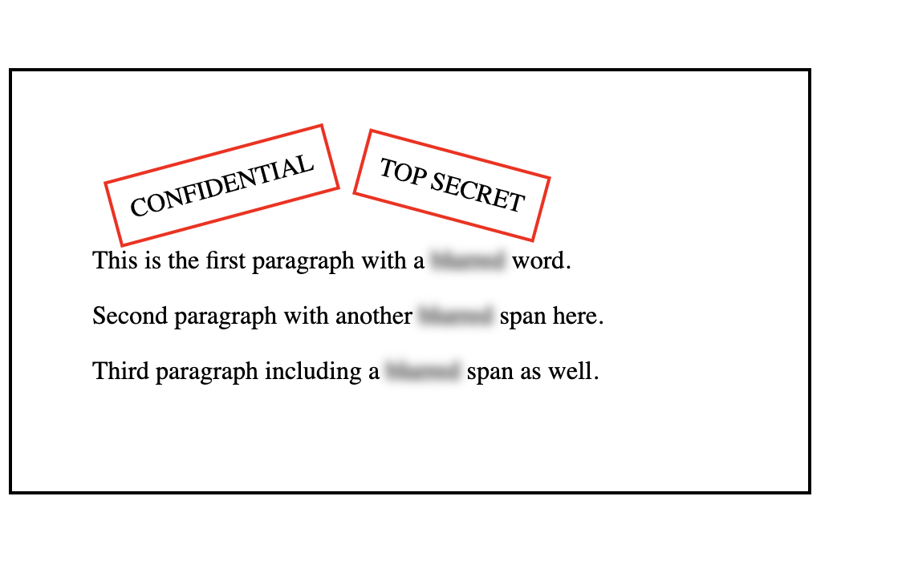

# Confidential Email Page 🔒
## 🖼️ Preview

A simple front-end project built using **HTML** and **CSS** that simulates a confidential email layout.  
The project focuses on visual styling techniques such as stamped labels, text blurring, and layout control.

## ✨ Features

- Email-style container layout
- “CONFIDENTIAL” and “TOP SECRET” stamped labels
- Blurred text effect to represent redacted information
- Clean and minimal design
- No JavaScript required

## 🛠️ Technologies Used

- HTML5
- CSS3

